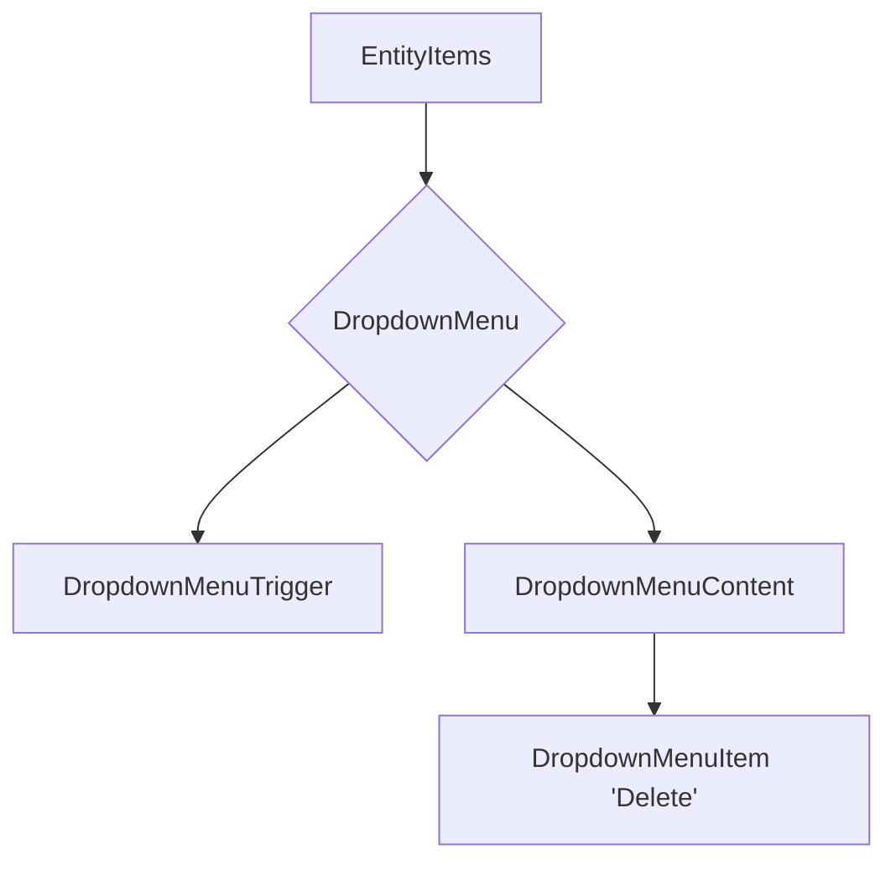

# Plan to Fix Delete Button Design

This plan outlines the steps to fix the delete button design in `src/components/entity-components.tsx` to match the provided image.

## 1. Current Implementation

The current implementation uses a `DropdownMenu` from `@radix-ui/react-dropdown-menu` to show the delete button. The styling is not aligned with the design in the image.



## 2. Proposed Changes

To fix the design, the following changes are required:

1.  **Remove incorrect styling**: The `className="bg-red-700 px-3"` on `DropdownMenuContent` is incorrect and should be removed.
2.  **Add correct styling to `DropdownMenuItem`**:
    - Add `flex items-center gap-x-2` to align the icon and text.
    - Add `text-red-500` to make the text color red for better UX on a delete action.
3.  **Ensure proper event handling**: The `onClick={(e) => e.stopPropagation()}` should be on the `DropdownMenuContent` to prevent the link from being triggered when the menu is opened.

## 3. Implementation Steps

The following steps will be performed in **Code Mode**:

1.  Read the file `src/components/entity-components.tsx`.
2.  Apply the following diff to the file:

    ```diff
    --- a/src/components/entity-components.tsx
    +++ b/src/components/entity-components.tsx
    @@ -324,14 +324,14 @@
                       </Button>
                     </DropdownMenuTrigger>
    ```

-                    <DropdownMenuContent
-                      className="bg-red-700 px-3"
-                      onClick={(e) => e.stopPropagation()}>
-                      <DropdownMenuItem onClick={handleRemove}>
-                        <TrashIcon className="size-4" />
-                        Delete
-                      </DropdownMenuItem>
-                    </DropdownMenuContent>

*                   <DropdownMenuContent onClick={(e) => e.stopPropagation()}>
*                     <DropdownMenuItem
*                       className="flex items-center gap-x-2 text-red-500"
*                       onClick={handleRemove}>
*                       <TrashIcon className="size-4" />
*                       Delete
*                     </DropdownMenuItem>
*                   </DropdownMenuContent>
                   </DropdownMenu>
                 )}
               </div>

  ```

  ```

3.  Save the changes.
4.  Ask the user to verify the changes in the browser.
